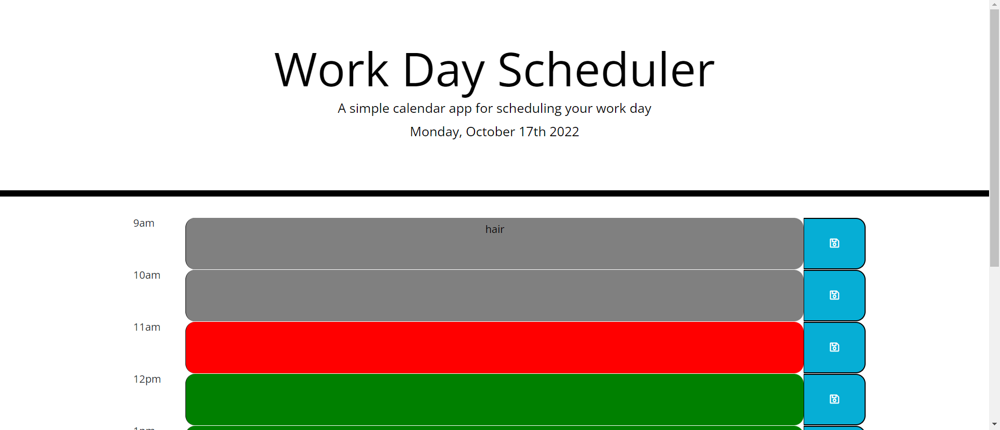

# Third Party APIs  

## Work Day Scheduler - Module 5  

A simple daily planner to organize our day. This app runs in the browser and features dynamically updated HTML and CSS powered by jQuery. The Moment.js library is used to work with time and date.  

Github Repo: https://github.com/tarajevans/scheduled-chaos  

Deployed Link: https://tarajevans.github.io/scheduled-chaos  

  

User Story  

AS AN employee with a busy schedule 
I WANT to add important events to a daily planner 
SO THAT I can manage my time effectively  

Acceptance Criteria  

GIVEN I am using a daily planner to create a schedule 
WHEN I open the planner 
THEN the current day is displayed at the top of the calendar 
WHEN I scroll down 
THEN I am presented with time blocks for standard business hours 
WHEN I view the time blocks for that day 
THEN each time block is color-coded to indicate whether it is in the past, present, or future 
WHEN I click into a time block 
THEN I can enter an event 
WHEN I click the save button for that time block 
THEN the text for that event is saved in local storage 
WHEN I refresh the page 
THEN the saved events persist 
